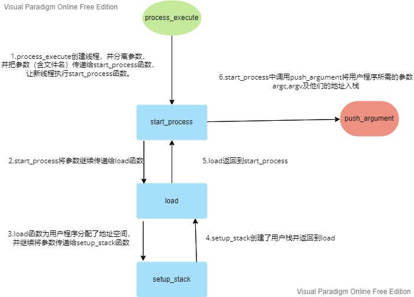

# Project 2 实验文档

[TOC]

## 团队 那遺矢dé圊舂|ゞ

### 基本信息

| 姓名   | 学号     | Git 用户名   |
| ------ | -------- | ------------ |
| 黄森辉 | 19231153 | BUAAhuangsh  |
| 陈逸然 | 19231005 | aurora-cccyr |
| 吴浩华 | 19231023 | async222     |
| 赵晰莹 | 19231235 | wellmslouis  |

### 每位组员的主要工作内容

### Git 相关

[Pintos 的 Git 项目地址](https://github.com/BUAAhuangsh/Pintos.git)

### 参考资料

1. []()
2. []()

## 实验要求

本次实验要求我们完成在运行用户程序时，操作系统对内存、调度等的管理。

大致要求可分为以下方面:

1.参数传递和打印进程终结信息

每当一个用户进程因为该进程调用`exit`或其它原因而结束时，需要打印该进程的进程名和退出码（`exit code`）；拓展process_execute函数功能，使其能够给新进程传递参数（将文件名和参数用空格分离）

2.系统调用

实现系统调用，需要根据系统提供的一组完成底层操作的函数集合，由用户程序通过中断调用，系统根据中断向量表和中断服务号确定函数调用，调用相应的函数完成相应的服务。

## 需求分析

## 设计思路

### **参数传递**


```c
tid_t
process_execute (const char *file_name) 
{
  char *fn_copy;
  tid_t tid;
  /* Make a copy of FILE_NAME.
     Otherwise there's a race between the caller and load(). */
  fn_copy = palloc_get_page (0);
  if (fn_copy == NULL)
    return TID_ERROR;
  strlcpy (fn_copy, file_name, PGSIZE);
  /* Create a new thread to execute FILE_NAME. */
  tid = thread_create (file_name, PRI_DEFAULT, start_process, fn_copy);
  if (tid == TID_ERROR)
    palloc_free_page (fn_copy); 
  return tid;
}
```

原来的`process_execute` 不支持传递参数给新的进程，因而现在的目标便是将文件名和参数共同读入并且完成传递。

其中字符串由空格切割分开，数组第0项为命令，其后为命令的参数

#### 实现思路图



修改后代码为

```c
tid_t
process_execute (const char *file_name)
{
  tid_t tid;

  char *fn_copy = malloc(strlen(file_name)+1);
  char *fn_copy2 = malloc(strlen(file_name)+1);
  strlcpy (fn_copy, file_name, strlen(file_name)+1);
  strlcpy (fn_copy2, file_name, strlen(file_name)+1);
  /*file_name是全局变量，将file_name拷贝为两份，避免在调用caller和load时发生资源上的冲突*/

  /* Create a new thread to execute FILE_NAME. */
  char * save_ptr;
  fn_copy2 = strtok_r (fn_copy2, " ", &save_ptr);//strtok_r线程安全，保存了上次切割留下来的saveptr
  tid = thread_create (fn_copy2, PRI_DEFAULT, start_process, fn_copy);
  /* 创建以file_name为名字的新线程，新的子线程执行start_process函数.fn_copy保存在kernel_thread_frame
  这个结构体的辅助数据aux里  */
  free (fn_copy2);//释放fn_copy2

  if (tid == TID_ERROR){
    free (fn_copy);
    return tid;
  }

  /* Sema down the parent process, waiting for child */
  sema_down(&thread_current()->sema);//降低父进程信号量，等待子进程结束
  if (!thread_current()->success) 
    return TID_ERROR;

  return tid;
}
```


接下来设计新的压栈函数`push_argument`

```c
/*传参数也就是压栈
  必须在用户线程被创建以及初始化之后
  在main被执行之前完成对应参数的传递*/
void
push_argument (void **esp, int argc, int argv[]){
  *esp = (int)*esp & 0xfffffffc;
  *esp -= 4;
  *(int *) *esp = 0;
  /*按照argc的大小，将argv压入栈*/
  for (int i = argc - 1; i >= 0; i--)
  {
    *esp -= 4;//入栈后栈指针减4
    *(int *) *esp = argv[i];
  }
  *esp -= 4;
  *(int *) *esp = (int) *esp + 4;
  *esp -= 4;
  *(int *) *esp = argc;//传入argc
  *esp -= 4;
  *(int *) *esp = 0;
}
```

`push_argument`函数完成了根据argc的大小将argv数组压入栈的操作。在`start_process`函数中被调用。压入栈顶的过程中，依次存放入参数argv数组（靠参数分离得到）、argv的地址和argc的地址。


然后修改`start_process`

```c
/* A thread function that loads a user process and starts it
   running. */
static void
start_process (void *file_name_)
{
  char *file_name = file_name_;
  struct intr_frame if_;
  bool success;

  char *fn_copy=malloc(strlen(file_name)+1);
  /*file_name的拷贝*/
  strlcpy(fn_copy,file_name,strlen(file_name)+1);

  /* Initialize interrupt frame and load executable. */
  /*初始化中断帧*/
  memset (&if_, 0, sizeof if_);
  if_.gs = if_.fs = if_.es = if_.ds = if_.ss = SEL_UDSEG;
  if_.cs = SEL_UCSEG;
  if_.eflags = FLAG_IF | FLAG_MBS;

  char *token, *save_ptr;
  file_name = strtok_r (file_name, " ", &save_ptr);
  /*调用load函数，判断是否成功load*/
  success = load (file_name, &if_.eip, &if_.esp);

    
 
    
  if (success){
    /* 计算参数个数并且分离 */
    int argc = 0;
    int argv[50];
    /*token也就是命令行输入的参数分离后得到的包含了argv的数组*/
    for (token = strtok_r (fn_copy, " ", &save_ptr); token != NULL; token = strtok_r (NULL, " ", &save_ptr)){
      if_.esp -= (strlen(token)+1);
      memcpy (if_.esp, token, strlen(token)+1);//栈指针退后token的长度，空出token长度的空间用来存放token
      argv[argc++] = (int) if_.esp;//argv数组的末尾存放栈顶地址，也就是argv的地址
    }
    push_argument (&if_.esp, argc, argv);
    /*将当前线程父线程的success设置为true并且提升其信号量*/
    thread_current ()->parent->success = true;
    sema_up (&thread_current ()->parent->sema);
  }

    
    

  /* 错误后退出*/
  else{
    thread_current ()->parent->success = false;
    sema_up (&thread_current ()->parent->sema);
    thread_exit ();
  }


  /* Start the user process by simulating a return from an
     interrupt, implemented by intr_exit (in
     threads/intr-stubs.S).  Because intr_exit takes all of its
     arguments on the stack in the form of a `struct intr_frame',
     we just point the stack pointer (%esp) to our stack frame
     and jump to it. */
  asm volatile ("movl %0, %%esp; jmp intr_exit" : : "g" (&if_) : "memory");
  NOT_REACHED ();
}
```

对于刚刚新创建的线程，先初始化中断帧，再调用`load`函数（`load`还会调用`setup_stack`，为程序分配内存并创建用户栈）。如果调用成功，分配好了地址空间并创建完成用户栈，则调用`push_argument`把argv数组压入栈顶，否则就退出当前的线程。

### 系统调用

#### 准备工作

系统调用是由系统提供的一组完成底层操作的函数集合，由用户程序通过中断调用，系统根据中断向 量表和中断服务号确定函数调用，调用相应的函数完成相应的服务。其主要目的，是在中断的时候根据系统调用号执行函数。大致流程为根据中断帧的指针，通过 esp 找到用户程序调用号和参数，再根据系统调用号，转向系统调用功能函数，并将参数传入，之后执行系统调用具体功能（如创建文件），最后执行完，将返回值写入 eax中。

在syscall.c中：

```c
void
syscall_init (void) 
{
  intr_register_int (0x30, 3, INTR_ON, syscall_handler, "syscall");
}
```

当用户程序调用系统调用以后，会激发30号中断，通过中断向量指向并运行syscall_handler（）函数。
在syscall_handler中，应该需要根据系统调用号来调用不同的系统调用。

```c
static void
syscall_handler (struct intr_frame *f UNUSED) 
{
  printf ("system call!\n");
  thread_exit ();
}
```

由参数传递部分可以知道，intr_frame 的 esp 栈顶里保存着中断服务号 NUMBER，并且在栈顶的后面若干个字节保存了调用的其他参数。我们需要把syscall 设计为一个调用其他函数的流程控制器，保持这个函数的过程清晰。

在lib/user/syscall.h下可以看到本次系统调用的用户需求和传递参数：

```c
void halt (void) NO_RETURN;
void exit (int status) NO_RETURN;
pid_t exec (const char *file);
int wait (pid_t);
bool create (const char *file, unsigned initial_size);
bool remove (const char *file);
int open (const char *file);
int filesize (int fd);
int read (int fd, void *buffer, unsigned length);
int write (int fd, const void *buffer, unsigned length);
void seek (int fd, unsigned position);
unsigned tell (int fd);
void close (int fd);
```

在lib/syscall­nr.h中则提供了对应的服务

```c
 /* Projects 2 and later. */
 SYS_HALT,                   /* Halt the operating system. */
 SYS_EXIT,                   /* Terminate this process. */
 SYS_EXEC,                   /* Start another process. */
 SYS_WAIT,                   /* Wait for a child process to die. */
 SYS_CREATE,                 /* Create a file. */
 SYS_REMOVE,                 /* Delete a file. */
 SYS_OPEN,                   /* Open a file. */
 SYS_FILESIZE,               /* Obtain a file's size. */
 SYS_READ,                   /* Read from a file. */
 SYS_WRITE,                  /* Write to a file. */
 SYS_SEEK,                   /* Change position in a file. */
 SYS_TELL,                   /* Report current position in a file. */
 SYS_CLOSE,                  /* Close a file. */
```

使用syscall_handler完成函数分配时有两种思路，一种用switch-case寻找对应的函数，另一种事先在syscall_init中声明函数指针数组，之后根据系统调用号选择函数。为了整体的简洁明了，这里我们选择第二种方法。

```c
# define max_syscall 20
// 系统调用数组的实现
static void (*syscalls[max_syscall])(struct intr_frame *);

void
syscall_init (void)
{
  //初始化30号中断，使其指向syscalls_handler
  intr_register_int (0x30, 3, INTR_ON, syscall_handler, "syscall");
  syscalls[SYS_HALT] = &sys_halt;
  syscalls[SYS_EXIT] = &sys_exit;
  syscalls[SYS_EXEC] = &sys_exec;
  syscalls[SYS_WAIT] = &sys_wait;
  syscalls[SYS_CREATE] = &sys_create;
  syscalls[SYS_REMOVE] = &sys_remove;
  syscalls[SYS_OPEN] = &sys_open;
  syscalls[SYS_WRITE] = &sys_write;
  syscalls[SYS_SEEK] = &sys_seek;
  syscalls[SYS_TELL] = &sys_tell;
  syscalls[SYS_CLOSE] =&sys_close;
  syscalls[SYS_READ] = &sys_read;
  syscalls[SYS_FILESIZE] = &sys_filesize;
}
```

我们知道系统调用号隐藏在f->esp中，在syscall_handler中获得系统调用号后检查其是否合法，如果合法，就执行对应函数。当pintos进行系统调用的时候，它先会调用静态函数syscall_handler (struct  intr_frame *f )，Intr_frame是指向用户程序寄存器。这里如果不合法，先将进程的结束状态改为-1，之后调用 thread_exit()终止进程，由 thread_exit()调用 process_exit()，释放进程所占用的资源。

```c
static void
syscall_handler (struct intr_frame *f)
{
  //得到系统调用的类型（系统调用号）（int）
  int type = * (int *)f->esp;
  if(type <= 0 || type >= max_syscall){
    thread_current()->st_exit = -1;//将进程的结束状态改为-1
    thread_exit ();//退出进程
  }
  syscalls[type](f);
}
```

此外，在基础的系统调用之上，我们有必要采取一系列措施，在用户程序产生不当操作时，终止用户进程。那么，对于用户提供的指针，在解引用前，必须先检查指针不为空、指针指向的是自己的用户虚存地址空间。

> 在访问错误中，我们大致可以将错误分为以下几种：
>
> 1.用户访问系统内存，对该区域的写操作有可能导致操作系统异常。
>
> 2.用户访问尚未被映射或不属于自己的用户虚存地址空间
>
> 3.参数无效导致文件加载失败

我们可以用一个统一的check_ptr函数进行安全检查。

> 目前的 pintos 有一个简单的虚存映射机制，大致的流程如下：
>
> 1)规定将实存一分为二，低空间分配给内核，高空间分配给用户；
>
> 2)系统初始化时，将指定 PHYS_BASE，高于 PHYS_BASE 的虚存地址空间分配给内核；
>
> 3)在初始化用户进程时，指定一块虚存地址空间给该进程，具体的页表信息保存在该进程对应线程的结构体 struct thread 中，其成员变量名为 pagedir; 

如果访问尚未被映射的地址空间或者错误的地址，会造成 page_fault，引发系统崩溃，因此，我们首先检查用户指针是否指向PHYS_BASE，这里直接用is_user_vaddr函数。

用户程序访问内核内存时，系统会调用 page_fault 函数，根据 page_fault 函数中确定产生原因的代码段功能（/* Determine cause. */），我们可以通过加一个 if(user)判断解析出是否是由用户程序造成的错误，如果是，按照确定的错误处理机制，调用 thread_exit()终止进程，返回失败信息­1。

```c
//IF USER ERROR IS FALSE THEN PUT THE RETURN ADDRESS INTO EIP AND RETURN ERROR INTO EAX
   if (!user)
   {
      f->eip = f->eax;
      f->eax = -1;
      return;
   }
```

之后我们需要检查，用户是否通过 system call机制访问到不该访问的地址，我们注意到用户调用 system call 时，实际上运行的是内核的代码，所以当由于 systemcall 参数不合法产生 page fault 时，Determine Cause 代码段认为它是内核造成的错误，从而引发 kernel panic，系统崩溃。这里使用pagedir_get_page函数进行检查，在pagedir.c中：

```c
/* Looks up the physical address that corresponds to user virtual
   address UADDR in PD.  Returns the kernel virtual address
   corresponding to that physical address, or a null pointer if
   UADDR is unmapped. */
void *
pagedir_get_page (uint32_t *pd, const void *uaddr) 
{
  uint32_t *pte;

  ASSERT (is_user_vaddr (uaddr));
  
  pte = lookup_page (pd, uaddr, false);//只使用其判断功能
  if (pte != NULL && (*pte & PTE_P) != 0)
    return pte_get_page (*pte) + pg_ofs (uaddr);
  else
    return NULL;
}
```

lookup_page(uint32_t *pd, const void *vaddr, bool create)这个函数，第一个参数指的是页表索引，第二个参数代表需要访问的虚存地址，函数的功能是判断该虚存地址是否在该页表索引指向的页中，第三个参数是一个执行选项，当 create为 true 时，激活该虚存地址所在页，否则只做判断。

```c
void * 
check_ptr2(const void *vaddr)
{ 
  //确保指针指向用户地址
  if (!is_user_vaddr(vaddr))
  {
    thread_current()->st_exit = -1;
    thread_exit ();
  }
  //确保页表命中
  void *ptr = pagedir_get_page (thread_current()->pagedir, vaddr);
  if (!ptr)
  {
    thread_current()->st_exit = -1;
    thread_exit ();
  }
  //part3
  uint8_t *check_byteptr = (uint8_t *) vaddr;
  for (uint8_t i = 0; i < 4; i++) 
  {
    if (get_user(check_byteptr + i) == -1)
    {
      thread_current()->st_exit = -1;
      thread_exit ();
    }
  }
  return ptr;//返回物理地址
}
```

这里的part3最开始没有想到，在测试的时候发现exec-bound2和exec-bound3两个测试点无法通过，通过查看测试，发现是文件系统调用时必须保证传递的字符串指针的每一个字节的指针都要有效。这里pintos提供了一个get_user函数，可以检查字节是否有段错误。

```c
/* 在用户虚拟地址 UADDR 读取一个字节。
   UADDR 必须低于 PHYS_BASE。
   如果成功则返回字节值，如果
   发生段错误则返回 -1 。*/ 
static int 
get_user (const uint8_t *uaddr)
{
  int result;
  asm ("movl $1f, %0; movzbl %1, %0; 1:" : "=&a" (result) : "m" (*uaddr));
  return result;
}
```

为了保证参数的有效性，我们在syscall_handler中统一检测第一个参数的合法性。

```c
/* Smplify the code to maintain the code more efficiently */
static void
syscall_handler (struct intr_frame *f UNUSED)
{
  int * a = f->esp;
  //检查第一个参数
  check_ptr2 (a + 1);
  //得到系统调用的类型（系统调用号）（int）
  int p = * (int *)f->esp;
  if(p <= 0 || p >= max_syscall){
    thread_current()->st_exit = -1;//将进程的结束状态改为-1
    thread_exit ();//退出进程
  }
  syscalls[p](f);
}
```

**`sys_WRITE`**

`sys_WRITE`可以实现系统向文件或屏幕写数据，具体实现思路是从用户栈中读取三个参数：fd，buffer和size。fd为写入类型，如果是向屏幕写入，则直接在终端输出，否则找到文件标识符并写入文件。（打开文件表将在打开文件时建立，具体参见sys_open，file_write函数由pintos提供）

```c
void 
sys_write (struct intr_frame* f)
{
   /*IN :fd(p+1),buffer(p+2),size(p+3)
 * OUT :eax=count */
  uint32_t *user_ptr = f->esp;
  check_ptr2 (user_ptr + 7);//检查最后一个参数
  check_ptr2 (*(user_ptr + 6));//检查buffer
  int fd = *(user_ptr+1);
  const char * buffer = (const char *)*(user_ptr+2);
  off_t size = *(user_ptr+3);
  /* STDOUT_FILE is 1, defined in lib/stdio.h */
  if (fd == 1) {
    /* 写入标准输出 */
    putbuf(buffer,size);
    /* putbuf is in lib/kernel/console */
    f->eax = size;
  }
  else
  {
    /*写入到文件 */
    struct thread_file * thread_file_temp = find_file_id (*user_ptr);
    if (thread_file_temp)
    {
      acquire_lock_f ();
      f->eax = file_write (thread_file_temp->file, buffer, size);
      release_lock_f ();
    } 
    else
    {
      f->eax = 0;
    }
  }
}
```

下面是参数获取的实例图。文件相关操作的参数获取和参数检查都大同小异，用write作为展示。


write实现之后，就可以向终端输出测试结果了，系统调用准备工作到此结束。

#### 系统调用_进程

进程方面的系统调用主要涉及`lib/syscall­nr.h`中前四个服务，对应的我们需要写四个函数：

```c
void sys_halt(struct intr_frame* index);
void sys_exit(struct intr_frame* index);
void sys_exec(struct intr_frame* index); 
void sys_wait(struct intr_frame* index);
```

##### `sys_halt`

`sys_halt`是关机函数，通过运行`devices/shutdown.h`中声明的`shutdown_power_off()`函数终止Pintos；

```c
// devices/shutdown.h

/* Powers down the machine we're running on,
   as long as we're running on Bochs or QEMU. */
void
shutdown_power_off (void)
{
  const char s[] = "Shutdown";
  // ...
}
```

##### `sys_exit`

`sys_exit`是退出进程函数，在`thread.c`中新增退出码`st_exit`以供后续使用；

```c
thread_current()->st_exit=*(((int*)f->esp)+1);//为当前线程保存退出码
thread_exit();
```

其中`f->esp`指向调用函数名，后+1代表系统调用的第一个参数，如下函数同理；

另外，该函数与后两种函数，都需调用`check_ptr2()`以检验参数正确性，特别的，对于函数`sys_exec()`还需检验存放调用函数所需要的参数地址的正确性，因此对于这两种调用定义函数如下：

```c
uint32_t
zxyA(struct intr_frame* f)
{
  uint32_t *ptr = f->esp;
  check_ptr2 (ptr + 1);
  *ptr++;
  return *ptr;
}

uint32_t
zxyB(struct intr_frame* f)
{
  uint32_t *ptr = f->esp;
  check_ptr2 (ptr + 1);
  check_ptr2 (*(ptr + 1));
  *ptr++;
  return *ptr;
}
```

##### `sys_exec`

`sys_exec`是开始另一程序的函数，调用了参数传递拟写的`process_execute`函数；

```c
f->eax = process_execute((char*)(f->esp));
```

##### `sys_wait`

`sys_wait`是等待子进程函数，根据需求，我们还需要在`process.c`文件中补写`process_wait`函数；

```c
f->eax = process_wait(((int*)f->esp)+1);
```

`process_wsit`函数原先已被写好，留待我们补充：

```c
/* Waits for thread TID to die and returns its exit status.  If
   it was terminated by the kernel (i.e. killed due to an
   exception), returns -1.  If TID is invalid or if it was not a
   child of the calling process, or if process_wait() has already
   been successfully called for the given TID, returns -1
   immediately, without waiting.

   This function will be implemented in problem 2-2.  For now, it
   does nothing. */
int
process_wait (tid_t child_tid UNUSED) 
{
  return -1;
}
```

通过注释我们了解到，这个函数在系统调用部分的作用为等待线程TID结束并返回其退出状态（现在始终返回-1）；如果因异常终止，则返回-1；如果TID无效或不是当前进程的子进程或已调用`process_wait()`，则返回-1.

在编写代码之前，我们需要统筹在实现`wait`的过程中都需要父子进程的哪些属性；因为需要知道父进程有哪些子进程，所以需要一个属性装有父进程拥有的子进程，对于返回值还需要增加返回状态；对于被装的子进程，我们也需要单独增加结构体子进程来标识其属性；最后在创建进程时，还需要初始化子进程以实现程序的正常运行；

为了实现如上情况，我们在`thread.h`中添加了新的属性：

```c
struct child
  {
    bool isrun;//运行状态
    struct list_elem child_elem;//子进程列表
    struct semaphore sema;//控制父进程等待的信号量
  };
```

同时修改了`thread.c/thread_create()`函数对子进程进行初始化；

```c
  t->thread_child = malloc(sizeof(struct child));
  t->thread_child->tid = tid;
  sema_init (&t->thread_child->sema, 0);
  list_push_back (&thread_current()->childs, &t->thread_child->child_elem);
  t->thread_child->store_exit = UINT32_MAX;
  t->thread_child->isrun = false;
```

实现代码如下：

首先找到当前子进程序列：

```c
struct list *childList = &thread_current()->childs;
```

为遍历该序列定义起始量`indexA`和当前量`indexB`：

```c
struct list_elem *indexA;
struct child *indexB;
```

在`indexA!=list_end(childList)`时循环遍历该子进程序列，如果当前判断的进程是子进程，则其停止运行，减少信号量以唤醒父进程，否则返回-1，否则`indexA`“++”；

```c
void
modifyChild(struct child *c)
{
  c->isrun = true;
  sema_down (&c->sema);
}
```

```c
int
judgeChild(tid_t child_tid,struct child *c)
{
  if (c->tid == child_tid){
      if (!c->isrun){modifyChild(c);return 1;} else return -1;
    }
  return 0;
}
```

如果循环全部也没能找到子进程，则直接返回-1；如果中途尚未返回-1，执行至此则说明判断成功，删除子进程以给父进程空出位置，最后返回；

```c
list_remove (indexA);
return indexB->store_exit;
```

#### 系统调用_文件

系统调用中的文件部分，有 create, remove, read, open, filesize, seek, tell, and close这几个函数。

```c
void sys_create(struct intr_frame* f); /* syscall create */
void sys_remove(struct intr_frame* f); /* syscall remove */
void sys_open(struct intr_frame* f);/* syscall open */
void sys_filesize(struct intr_frame* f);/* syscall filesize */
void sys_read(struct intr_frame* f);  /* syscall read */
void sys_seek(struct intr_frame* f); /* syscall seek */
void sys_tell(struct intr_frame* f); /* syscall tell */
void sys_close(struct intr_frame* f); /* syscall close */
```

为实现文件操作，首先需要根据文件标识符来查找文件`find_file_id`。这个函数利用了我们在thread.c和thread.h中新定义的几个结构体

```c
struct thread_file * find_file_id (int file_id)
{
 struct list_elem *e;
 struct thread_file * thread_file_temp = NULL;
 struct list *files = &thread_current ()->files;
 for (e = list_begin (files); e != list_end (files); e = list_next (e)){
  thread_file_temp = list_entry (e, struct thread_file, file_elem);
  if (file_id == thread_file_temp->fd)
   return thread_file_temp;
 }
 return false;
}
```

`create`

创建一个文件，首先获取命令行参数，包括了文件名，地址。check保证合法性，然后获取文件的锁，调用`filesys_create`创建文件，最后需要释放锁。

`remove`
删除一个文件，check保证命令行传来的参数合法性，获取锁，调用`filesys_remove`删除，释放锁.

`read`

对参数进行判断，获取fd输入文件描述符，buffer缓存区，size读取大小。如果参数fd为0，为标准输入，即为从控制台读入数据。调用input_getc()读取数据入缓存区buffer，并返回读取的字节数。

如果参数fd不是0，那么通过`find_file_id`获取文件，如果查询到了文件，获取锁，调用file_read读取文件数据入缓存区buffer，返回读取的字节数。释放锁。若没找到文件，返回-1。

`open`
打开一个文件，check保证命令行传来的参数合法性，获取锁，调用`filesys_open`打开文件，释放锁。获取当前线程，并且为文件设置一个新的文件标识符fd，fd是线程结构体中的一个属性记录了当前线程的最大文件标识符。最后将文件放入线程的打开文件的列表中，返回文件的标识符。

`filesize`
通过`find_file_id`获取文件。调用`file_length`返回以文件标识符fd指代的文件的大小。

`seek`
通过`find_file_id`获取文件，获取文件的锁，根据传入的参数，使用`file_seek`函数把下一个要读入或写入的字节跳转到指定文件的指定位置。

`tell`
通过`find_file_id`获取文件，获取文件的锁，根据传入的参数，使用`file_tell`函数把下一个要读入或写入的字节的位置返回。

`close`
通过`find_file_id`获取文件，获取文件的锁。如果文件打开，调用`file_close`关闭文件，关闭后，把这个文件从线程的文件list中移除并释放资源。

## 重难点讲解

测试样例中提供了这样一个测试 multi­-oom,该测试通过用户进程不断地做递归调用，并且不断地进行打开文件操作，并随机地终止某一个线程。该测试考察到了系统平均负载，资源利用率，以及系统的稳定性，具体考察过程如图：


**忙等待造成超时处理**

在之前设计 process_wait 函数中，我们设置了一个 while(1)死循环，利用get_thread_ by_tid (child_tid)函数得到目标进程，然后检查该进程的运行状态,发现状 态是 THREAD_DYIN G，　即可得到返回值退出循环。 

但是在实际运行过程中，随着递归层数的加深，进程创建的速度越来越慢，测试程序有一个时间限制：360 秒，然而采取刚才所说的方法不能按时跑完。我在调试过程中，注意检查创建线程所调用的函数，发现没有任何操作的耗时会随着线程数量的增加而增加，加入调试信息发现，创建线程的每一步操作耗时都是线性增长的，由此判断出程序调度过程中发生了忙等待。此时，我们设计出利用信号量的方法实现 process_wait()函数，解决了测试超时的问题。当程序递归调用时，process_wait()在子线程运行完毕之前会通过 sema_down()进入子线程 wsem 成员变量的 wait_list 里，在子线程运行完毕进入 process_exit()阶段sema_up()该信号量唤醒父线程。这样一来，在递归调用过程中，实际上只有一个线程在ready_list 之中，递归速度大大加快。

**内存资源释放操作**

在 multi­oom 运行时，进程会不停地打开文件，并且不去关闭，如果不在进程退出时关闭这些文件，释放这些文件的文件描述符(fd)，会造成内存泄漏，影响系统效率。

解决办法首先是修改 struct thread 数据结构，向前文描述的，加入 fd_list,用来保存由该进程打开文件的文件描述符，在进程退出函数 process_exit()之中，遍历 fd_list 的每一个结点，通过 list_entry 函数解析出文件指针，用 file_close()函数来关闭所有文件，之后，调用 free 函数释放文件描述符 fd 的内存空间，这样便可以防止内存资源的泄漏，在这个方面上保证pintos 操作系统的性能。

**系统平均负载能力测试**

系统平均负载能力反映在同时处于就绪状态的线程数，在本测试中，对应的就是递归调用的层数，层数越多，并发能力越强，而就绪程序越多，对于系统的压力就越大。我们需要测试出 pintos 操作系统的并发能力上限，对用户创建线程做出一定限制，以保证 pintos 系统正常运行。

### `sys_exec`流程图


### `sys_wait`流程图


## 用户手册

在userprog文件夹下：

make clean

make check

## 测试报告

## 各成员的心得体会

### 黄森辉
这次实验我主要负责参数传递部分，参数传递部分是整个实验的基础部分，因而我需要较早的开始编码。参数传递需要修改的代码并不是很多，集中在`process.c`这个文件中。总体而言完成参数的压栈，创建用户栈并且分配用户空间。值得思考的地方在于调用函数切割输入的参数并且将其压入栈，这使得操作系统能够完成对文件的命令行操作，而原来的pintos代码没有这个功能。另外比较困难的点在于把参数压入esp的指针操作，这个问题我是问了同学才理清楚指针的逻辑。

### 陈逸然

  本次实验我主要负责系统调用的准备工作，主要为对函数指针数组初始化工作（syscall_init），初步检查合法性并选择函数（syscall_handler）和用户内存访问安全性保障工作（check_ptr2)和系统调用函数sys_write的完成。其中最麻烦的还是用户内存访问错误检测。

  操作系统是一个特殊的程序，它控制着整个计算机的运行，在用户程序符合要求的情况下，稳定和正确是操作系统运行的基本要求。但是仅仅做到这一点还不够，我们不能对用户的行为做出任何假设，用户很可能会作出不当操作，这些不当操作有可能是用户粗心大意，也可能是有意为之，无论何种情况引发的不当操作造成操作系统的崩溃都有可能造成用户的损失。因此，系统的健壮性是评价一个操作系统优劣的重要指标。我们必须在用户程序产生不当操作时，终止用户进程，而不是任其执行，造成操作系统崩溃。

  我们需要防止用户访问系统内存、需要防止用户访问尚未被映射的错误内存和不属于自己的虚存，错误的情况多种多样，必须对虚拟内存和pintos的机制有一定了解，再根据测试点完成。整体作业还是非常困难的，但是能够感觉到自己对os的理解也有了提高。

### 吴浩华

这次实验我负责的是系统调用的文件部分。文件部分的系统调用总体比较简单。文件标识符fd使用了比较简单的线性增长的解决方案。还有就是文件调用中需要对传递过来的参数进行检查。需要注意检查的参数内容和地址的边界。除了这些工作以外，我还协助了陈逸然同学对系统调用的准备工作进行一些思路的理解。

最后编写了文档末尾的思考题内容，让我收益匪浅。

### 赵晰莹

这次实验中我负责的是系统调用的进程部分，实则与各个部分都有衔接，联系紧密。`syscall.c`中大多是规范操作，取参数、检查参数及其它需要的量、调用其它函数以解决，整体而言算是承上启下的作用；`process.c/process_wait`中涉及到了一些父子进程知识，总体上还是一个判断子进程的大循环，我们所使用的信号量使能合理有效地运行；另外我还修补了`thread.c`和`thread.h`，大约是边边角角的增加属性与初始化方法。

起初的分工是一个难点，我们三个人搞系统调用无法明确界限，而我以为还是明确的分工才能得到高效的成果。于是在我们三个人的反复商量后，剖析出了`syscall.c`的一堆需要填补的函数，终于可以大约明确的分个工了。p2不比p1，没那么明确的承接，流水线作业优点是合并容易，但是缺点也是一堆bug和每两个人的思路都小有差异，第一次写完之后一个点都过不了真的是非常崩溃......后来我们又聚在一起研讨了好久，一个函数一个函数的讨论，才终于能过了80个点，尤其是一个细小的差异都能从3个点不过到50个点不过（亲身经历T T）。后来又经过添加详细注释与多次优化代码终于有了最后的成品，想想从开始啥也不会到现在也能胡诌一个操作系统，还是在时间的淬炼里有了不知不觉的提升。

## 其他你认为有必要的内容 (Optional)

# Project 2 Design Document

## QUESTION 1: ARGUMENT PASSING

### DATA STRUCTURES

> A1: Copy here the declaration of each new or changed `struct` or `struct` member, global or static variable, `typedef`, or enumeration. Identify the purpose of each in 25 words or less.
>
> in `thread.h`
>
> 新增
>
> ```c
>  	struct list childs;                 
>     struct child * thread_child;        
>     int st_exit;                        
>     struct semaphore sema;              
>     bool success;                       
>     struct thread* parent;              
> ```
>
> in `process.c`
>
> 修改`process_execute`
>
> 修改`start_process`
>
> 

### ALGORITHMS

> A2: Briefly describe how you implemented argument parsing. How do you arrange for the elements of argv[] to be in the right order? How do you avoid overflowing the stack page?
>
> A2: 简要描述你是怎么实现 Argument parsing 的。你是如何安排 argv[]中的 elements，使其在正确的顺序的？你是如何避免 stack page 的溢出的？
>
> `process_execute()`提供的`file_name`包括了命令和。把它们分成两部分， 为程序名和参数串。然后，创建新的thread，其名字为分离出的第一个token。
>
> 当设置stack的时候，优先将参数放到栈顶，并且记录参数对应的地址。随后将每个token的地址依次压入栈中。其中包括`word align`、`argv[argc]`、`argv[]`、`argc`、`return addr`等。

### RATIONALE

> A3: Why does Pintos implement strtok_r() but not strtok()?
>
> A3: 为什么 Pintos 中实现 strtok_r()而不是 strtok()？
>
> `strtok_r()`比`strtok()`多了`save_ptr`，是它的线程安全版本。从strtok_r输出的缓冲是在内部分配的，在程序结束的时候，库会进行释放操作。

> A4: In Pintos, the kernel separates commands into a executable name and arguments. In Unix-like systems, the shell does this separation. Identify at least two advantages of the Unix approach.
>
> A4: 在 Pintos 中，kernel 将命令分成了可执行文件的 name 以及参数。在 Unix-like 的系统中，shell 完成这部分的分隔。列举至少 2 种 Unix 这样做的好处。
>
> 1.缩短内核内部运行的时间。
>
> 2.把命令传递给下一部分程序之前，检查参数是否超过限制以避免kernel fail。
>
> 3.在讲命令传递给下一部分程序之前，检查参数是否超过限制以避免kernel fail。

## QUESTION 2: SYSTEM CALLS

### DATA STRUCTURES

> B1: Copy here the declaration of each new or changed `struct` or `struct` member, global or static variable, `typedef`, or enumeration. Identify the purpose of each in 25 words or less.

- <thread.c> 

  - 建立了一个文件锁.

    ```C
    /*使用文件锁来保证文件操作时的安全性*/
    static struct lock lock_file;
    ```

  - 上锁和放锁函数。

    ```c
    /*获取线程的文件锁*/
    void acquire_lock_file (){
     lock_acquire(&lock_file);
    }
    /*释放线程的文件锁*/
    void release_lock_file (){
     lock_acquire(&lock_file);
    }
    ```

- <thread.h> 

  - 建立了一个新的结构体，结构体内使用链表file_elem来储存当前线程拥有的所有文件。fd作为文件的查询标识符。

    ```
    struct thread_file {
      int fd;
      struct file* file;
      struct list_elem file_elem;
     };
    ```

    ```c
    struct list_elem 
     {
      struct list_elem *prev;   /* Previous list element. */
      struct list_elem *next;   /* Next list element. */
     };
    ```

  - struct thread中新增 

    - list files 保存当前线程所有已经打开的文件。
    - file_fd是一个只增不减的数，每当打开一个新文件都会加一，并把这个file_fd作为新打开文件的文件标识符fd，以此实现文件和文件标识符的一一对应。
    - file_owned，保存当前线程最新打开的文件。

    ```C
    struct list files;        /* List of opened files */
    int file_fd;             /* File's descriptor */
    struct file * file_owned;     /* The file opened */
    ```

> B2: Describe how file descriptors are associated with open files. Are file descriptors unique within the entire OS or just within a single process?
>
> B2: 描述文件描述符是如何与打开文件相联系的。文件描述符是在整个中唯一还是仅在单个进程中唯一？

初始时线程的结构体中file_fd设置为2，0和1留给了标准输入和标准输出。

每当线程打开一个新的文件，将file_fd的值设置为该文件的标识符，然后file_fd+1，为下一次打开文件准备。接着，将文件推入线程的文件链表中，列表里储存了线程已经打开了但是还没有关闭的文件。当我们需要对这些已经打开的文件进行操作时，只需要根据fd来对文件链表进行查找即可。

以此类推，这个线程打开的文件就和文件标识符一一对应了。但是不同线程的文件标识符不唯一。

### ALGORITHMS

> B3: Describe your code for reading and writing user data from the kernel.
>
> B3: 描述你用来从 kernel 中读写文件的代码。

read：

首先对参数进行判断，获取fd输入文件描述符，buffer缓存区，size读取大小。如果参数fd为0，为标准输入，即为从控制台读入数据。调用input_getc()读取数据入缓存区buffer，并返回读取的字节数。

如果参数fd不是0，那么通过`find_file_id`获取文件，如果查询到了文件，获取锁，调用file_read读取文件数据入缓存区buffer，返回读取的字节数。释放锁。若没找到文件，返回-1。

write：

具体实现思路是从用户栈中读取三个参数：fd，buffer和size。fd为写入类型，如果是向屏幕写入，则直接在终端输出，否则找到文件标识符并写入文件。（打开文件表将在打开文件时建立，具体参见sys_open，file_write函数由pintos提供）

> B4: Suppose a system call causes a full page (4,096 bytes) of data to be copied from user space into the kernel. What is the least and the greatest possible number of inspections of the page table (e.g. calls to pagedir_get_page()) that might result? What about for a system call that only copies 2 bytes of data? Is there room for improvement in these numbers, and how much?
>
> B4: 假设一个系统调用造成一整页的数据(4096 bytes)从用户空间复制到 kernel。
>
> 求可能造成的最小和最大的页表的检查次数。(e.g. 对 pagedir_get_page()的调用)。如果系统调用只 copy 了 2 bytes 的数据呢？还有没有空间优化？可以优化多少？

对于完整的数据页：最少检查一次，如果第一次检查就能获得页的头指针，那么我们从返回的地址可以看出，不需要任何检查。当它不是连续的，我们必须检查每一个地址来保证用户进程拥有合法的权限，此时最大为4096次。当它是连续时，我们获得一个不是页头指针的虚拟地址，还要检查开始指针和结束指针，查看它们是否映射，所以最大是2次。
对于2 bytes的数据：最少为1，如上文，如果我们获得了一个大于2字节的地址空间，就不需要再检查了。最大是2，如果它是不连续的或者他是不连续的（返回页表的末尾），我们必须检查另一个字节的位置。
我们觉得没有什么优化的空间。

> B5: Briefly describe your implementation of the "wait" system call and how it interacts with process termination.
>
> B5: 简要描述你"wait"系统调用的实现以及它是如何与进程停止交互的。

**详细可查看“需求分析-系统调用-系统调用_进程中`sys_wait`函数与重难点分析-`sys-wait`；**

简单而言，遍历所有子进程，对其进行判断，如果是当前进程的子进程还已经运行结束，就退出，返回退出状态；如果是当前进程的子进程但是没运行结束，就接着等待；如果遍历结束也没找到则返回-1。

> B6: Any access to user program memory at a user-specified address can fail due to a bad pointer value. Such accesses must cause the process to be terminated. System calls are fraught with such accesses, e.g. a "write" system call requires reading the system call number from the user stack, then each of the call's three arguments, then an arbitrary amount of user memory, and any of these can fail at any point. This poses a design and error-handling problem: how do you best avoid obscuring the primary function of code in a morass of error-handling? Furthermore, when an error is detected, how do you ensure that all temporarily allocated resources (locks, buffers, etc.) are freed? In a few paragraphs, describe the strategy or strategies you adopted for managing these issues. Give an example.
>
> 任何在用户指定的地址上对用户程序的内存的访问可能因为指针错误而失败。此类访问一定导致进程终止。系统调用充满了这样的访问。如一个“写”系统调用需要先从用户栈中读系统调用号，然后每一个调用的 3 个参数，然后是任意数量的用户内存。任何这些都可能造成失败。这构成一个设计错误处理的问题：如何最好地避免混淆主要错误处理的烦恼？此外，当错误被检查到，你如何保证所有的临时开出的资源（锁、缓冲区等）都被释放？用几段话来描述你处理这些问题的策略。

首先，对于每一个传入syscall_handler的f，我们都会首先检查第一个参数是否为空，如果不为空才会接着执行下面的系统调用函数。在写函数中，我们需要获得三个参数，分别是fd，buffer和size，第一个参数fd一定不为空，那么接下来看buffer和size对应的指针是否合法（利用check_ptr2），会检测指针是否为空、是否指向用户内存、是否已映射到进程的页面目录，对应的每个字节是否都有效。一旦发生用户内存访问错误，我们会退出当前进程。只有一切都检查完毕后，我们才会进行资源的分配。

### SYNCHRONIZATION

> B7: The "exec" system call returns -1 if loading the new executable fails, so it cannot return before the new executable has completed loading. How does your code ensure this? How is the load success/failure status passed back to the thread that calls "exec"?
>
> B7: 如果新的可执行文件加载失败，"exec"系统调用会返回-1，所以它不能够在该新的可执行文件成功加载之前返回。你的代码是如何保证这一点的？加载成功/失败的状态是如何传递回调用"exec"的线程的？

我们使用了信号量同步机制的exec流程，start_process后会进行sema_down，直到成功加载后才会sema_up；

通过返回确定的tid（>0成功，-1失败）传递给父进程。

> B8: Consider parent process P with child process C. How do you ensure proper synchronization and avoid race conditions when P calls wait(C) before C exits? After C exits? How do you ensure that all resources are freed in each case? How about when P terminates without waiting, before C exits? After C exits? Are there any special cases?
>
> B8: 考虑有父进程 P 和它的子进程 C。当 P 在 C exit 之前调用 wait(C)时，你如何确保同步以及如何避免争用的情况？你如何确保在每种情况下，所有的资源都被释放？如果 P 在 C exit 之前，没有 waiting 便终止？如果在 C exit 之后？有什么特殊情况吗？

与上题类似，`wait(C)`先sema_down信号量阻塞父进程，而后sema_up唤醒父进程；

在当前进程退出时只释放子进程的资源，保留自己thread结构直到父进程退出再释放；

### RATIONALE

> B9: Why did you choose to implement access to user memory from the kernel in the way that you did?
>
> B9: 为什么你使用这种方式来实现从内核对用户内存的访问？

这种方式比较简洁明了。

> B10: What advantages or disadvantages can you see to your design for file descriptors?
>
> B10: 你对文件描述符的设计有什么优劣吗？

优点：结构简单，使用thread结构体里面的一个属性来对文件描述符进行记录，保证了每一个新打开的文件都有与之对应的文件描述符。再通过链表储存，链表查找。

缺点：使用过的文件描述符就被废弃了无法再次利用。例如当前线程只允许打开500个文件，文件描述符最大到500，但是在次之前对一个文件反复打开，关闭使得文件描述符只增不减。到最后虽然当前线程只打开了一两个文件，但是文件描述符却不够用了。

> B11: The default tid_t to pid_t mapping is the identity mapping. If you changed it, what advantages are there to your approach?
>
> B11: 默认的 tid_t 到 pid_t 的映射是 identity mapping。如果你进行了更改，那么你的方法有什么优点？

我们没有对它进行修改。我们认为现有的方法以及足够适用。
